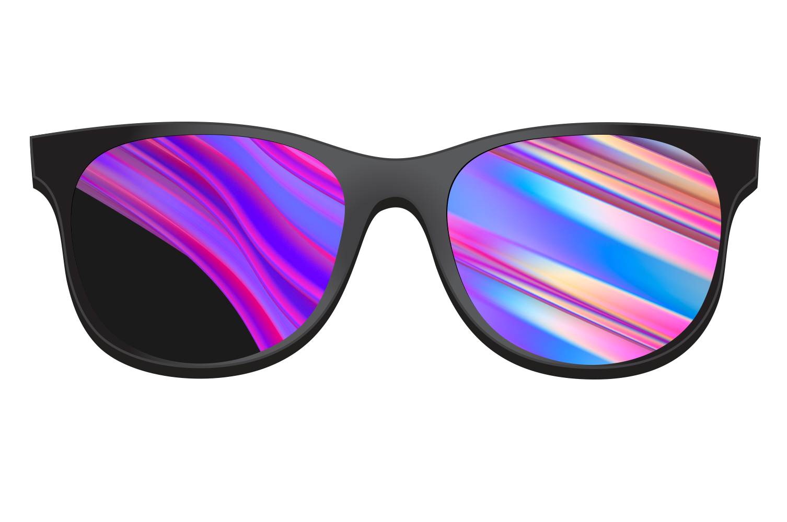

# Lesson (2) - Discofy an Image
## At this point you should have
1. Have downloaded and ran the code lab docker 

## Next steps  
Use face detection to put cool disco shades on Michael's face
1. Start with `glasses_2.py`
1. Look at `mesh_overlays` and `overlay_transparent` 
these are the main functions that you'll use for the detection and meshing 
of the images 
1. Complete function `discofy_image`. Lookup documentation of `cv2` 
to learn how to read and write images.
1. To run your code:
    ```{r, engine='bash', discofy_image}
    cd <project's root dir> 
    docker run -it -v `pwd`:/home/codelab/ -w /home/codelab/lessons/lesson_2/ discofy:dld.local python glasses_2.py <input image path> <output image path>
    ``` 
1. To test your solution: 
    ```{r, engine='bash', run_pytest}
    cd <project's root dir>
    docker run -it -v `pwd`:/home/codelab/  -w /home/codelab/lessons/lesson_2 discofy:dld.local pytest
    ```


  
 

 

